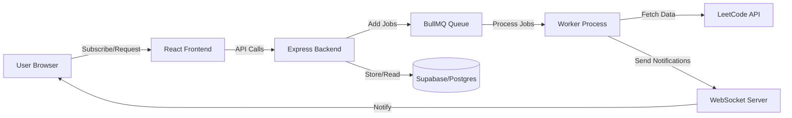
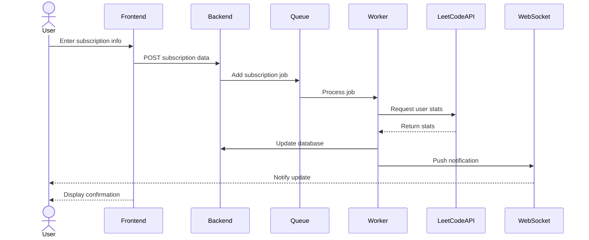

# Leetcode Notifier

**Stay updated with your LeetCode progress effortlessly**

A modern web application that notifies you of your LeetCode activities and progress in real-time. Automate your coding challenge tracking and never miss an update on your problem-solving streaks and contest rankings.

leetcode-notifier-js provides a seamless notification service for LeetCode users, integrating backend job queues, real-time WebSocket communication, and a React-based frontend for easy subscription management.

---

## Table of Contents

- [Introduction](#introduction)
- [Features](#features)
- [Architecture](#architecture)
- [Workflow](#workflow)
- [Tech Stack](#tech-stack)
- [Installation](#installation)
- [Project Structure](#project-structure)
- [Usage](#usage)

---

## Introduction

LeetCode users often struggle to keep track of their daily problem-solving progress and contest updates without manually checking the platform. This project solves that by sending timely notifications based on user subscriptions, ensuring that users stay motivated and informed effortlessly.

This tool benefits:
- Competitive programmers wanting real-time updates.
- Developers tracking their daily coding habits.
- Teams monitoring coding challenges collectively.

| Feature                | leetcode-notifier-js                       | Alternative A                      | Alternative B                   |
|------------------------|-------------------------------------------|----------------------------------|--------------------------------|
| Real-time notifications | ✅                                        | ❌                               | ✅                             |
| User subscription mgmt  | ✅                                        | ✅                               | ❌                             |
| Multi-channel alerts    | Planned                                   | Limited                          | Limited                        |
| Backend queue system    | BullMQ with Redis                         | Simple cron jobs                 | Message queue (RabbitMQ)       |
| Frontend framework      | React + Vite                             | Vue                             | Angular                       |
| Security features       | Helmet, Rate limiting                     | Minimal                         | Moderate                      |
| Open-source            | ✅                                        | ❌                               | ✅                             |

---

## Features

### Core Features
- 🛎️ **Real-time notifications:** Instant updates on LeetCode activity via WebSockets.
- 📅 **Timezone aware:** User subscriptions respect local timezones for notifications.
- 🔒 **Secure backend:** Rate limiting and security headers protect API endpoints.
- 🔄 **Robust queue system:** BullMQ with Redis handles background jobs reliably.

### Developer Experience
- ⚙️ **Modern tech stack:** React with Vite for fast frontend development.
- 🧪 **Schema validation:** Zod ensures backend data integrity.
- 🔧 **Linting & formatting:** ESLint configured for consistent code style.
- 🔄 **Hot Module Replacement:** Frontend supports HMR for rapid iteration.

### Deployment
- ☁️ **Cloud-ready:** Easily deployable on platforms like Render.
- 🔑 **Environment configuration:** Uses dotenv for flexible environment setup.

---

## Architecture



| Component      | Role                             | Technology                  |
|----------------|---------------------------------|-----------------------------|
| Frontend       | User interface and subscription | React, Vite                 |
| Backend        | API and business logic           | Express, Node.js            |
| Queue          | Job scheduling and processing   | BullMQ, Redis               |
| Worker         | Background job execution         | Node.js                    |
| WebSocket      | Real-time communication          | ws (WebSocket library)      |
| Database       | Persistent storage               | Supabase (PostgreSQL)       |
| Security       | Protect APIs                    | helmet, rate-limit          |

---

## Workflow



1. The user submits their LeetCode username, email, and timezone via the frontend.
2. The frontend sends subscription data to the backend API.
3. The backend enqueues a job to process the subscription.
4. The worker fetches the latest user stats from the LeetCode API.
5. User data is saved or updated in the database.
6. The worker pushes real-time notifications to the user via WebSocket.
7. The frontend displays success messages and real-time updates.

---

## Tech Stack

| Layer          | Technology           | Purpose                        |
|----------------|---------------------|--------------------------------|
| Frontend       | React, Vite         | UI and client-side routing     |
| Backend        | Node.js, Express    | REST API and business logic    |
| Job Queue      | BullMQ, Redis       | Background job management      |
| Database       | Supabase (Postgres) | Data persistence and querying  |
| Real-time Comm | ws (WebSocket)      | Push notifications             |
| Security       | helmet, rate-limit  | API protection and rate limiting|

---

## Installation

### Prerequisites

- Node.js (v18+ recommended)
- Redis server running
- Supabase account and project
- Google API credentials (for OAuth if applicable)
- Yarn or npm package manager

### Quick Start

```bash
git clone https://github.com/Tharanika-R-Git/leetcode-notifier-js.git
cd leetcode-notifier-js
npm install
```

### Environment Setup

```bash
cp .env.example .env
# Edit .env and fill in required keys such as:
# SUPABASE_URL, SUPABASE_SERVICE_ROLE_KEY, REDIS_URL, GOOGLE_CLIENT_ID, GOOGLE_CLIENT_SECRET, etc.
```

---

## Project Structure

```
leetcode-notifier-js/

├── backend.js             # Express backend server entry
├── frontend/              # React frontend app
│   ├── src/
│   │   ├── App.jsx       # Main React app component
│   │   ├── main.jsx      # Frontend entry point
│   │   ├── index.css     # Global styles
│   │   └── ...           # Other React components and assets
│   ├── package.json      # Frontend dependencies & scripts
│   └── README.md         # Frontend specific docs
├── .env.example          # Environment variable template
├── package.json          # Backend dependencies & scripts
├── README.md             # This file
└── ...                   # Other config and utility files
```

---

## Usage

### Basic Example

Subscribe to notifications by filling out the form on the frontend:

```jsx
// React subscription example snippet
function SubscribePage() {
  const [formData, setFormData] = React.useState({
    username: '',
    email: '',
    timezone: Intl.DateTimeFormat().resolvedOptions().timeZone,
  });

  const handleSubmit = async () => {
    await fetch('https://leetcode-notifier-js-backend.onrender.com/api/subscribe', {
      method: 'POST',
      headers: { 'Content-Type': 'application/json' },
      body: JSON.stringify(formData),
    });
  };

  return (
    // JSX form elements for username, email, timezone
  );
}
```

### Advanced Example

Integrate WebSocket client to listen for live notifications:

```js
const socket = new WebSocket('wss://leetcode-notifier-js-backend.onrender.com/ws');

socket.onopen = () => {
  console.log('Connected to notification server');
  socket.send(JSON.stringify({ action: 'subscribe', username: 'yourUsername' }));
};

socket.onmessage = (event) => {
  const notification = JSON.parse(event.data);
  console.log('Received notification:', notification);
  // Update UI or trigger alerts
};

socket.onerror = (err) => {
  console.error('WebSocket error:', err);
};

socket.onclose = () => {
  console.log('Disconnected from notification server');
};
```

---

Thank you for checking out **leetcode-notifier-js**! Contributions and feedback are welcome. Happy coding! 🚀

## License
This project is licensed under the **MIT** License.

---
🔗 GitHub Repo: https://github.com/Tharanika-R-Git/leetcode-notifier-js
